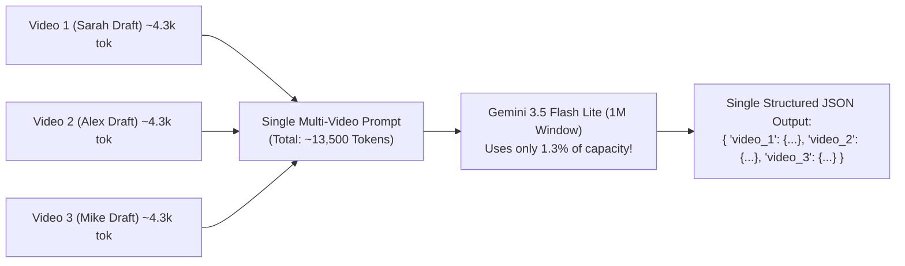
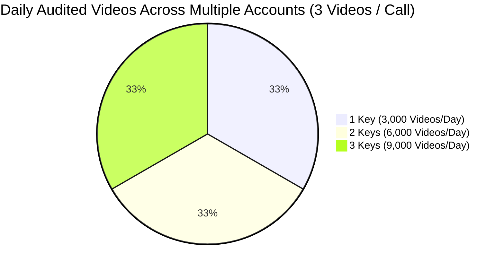

# Multi-Model Architecture & Quota Strategy 🚀

Complete documentation of model quotas, context windows, multi-key rotation, and the **Multi-Video Batching Strategy**.

---

## 1. Model Quotas & Context Window Comparison

Verified directly via Google Gemini API:

| Model | Input Context Window | Output Token Limit | Free RPM (Req/Min) | Free RPD (Req/Day) | Native Video + Audio? |
| :--- | :--- | :--- | :--- | :--- | :--- |
| **`gemini-3.5-flash-lite`** | **1,048,576 (1M)** | **65,536 (64k)** | **15 RPM** | **500 RPD** | ✅ **YES (3.38s latency)** |
| **`gemini-3.1-flash-lite`** | **1,048,576 (1M)** | **65,536 (64k)** | **15 RPM** | **500 RPD** | ✅ **YES (3.38s latency)** |
| **`gemini-3.6-flash`** | 1,048,576 (1M) | 65,536 (64k) | 5 RPM | 20 RPD | ✅ YES (8.5s latency) |
| **`gemini-3.7-flash`** | 1,048,576 (1M) | 65,536 (64k) | 5 RPM | 20 RPD | ✅ YES |
| **`gemini-3.8-flash`** | 1,048,576 (1M) | 65,536 (64k) | 5 RPM | 20 RPD | ✅ YES |
| **`gemini-3.5-flash`** | 1,048,576 (1M) | 65,536 (64k) | 5 RPM | 20 RPD | ✅ YES |

> [!IMPORTANT]
> **Flash Lite has the exact same 1,000,000 (1 Million) token context window as standard Flash!**
> It also provides a **65,536 output token limit**, allowing it to output extensive multi-video reports.

---

## 2. Multi-Video Batching Strategy (The 3x Capacity Multiplier)

Because `gemini-3.5-flash-lite` and `gemini-3.1-flash-lite` both feature a **1 Million token context window**, we can pass **2 to 3 videos in a single API call**:



### The Capacity Math:
* A 30–45 second vertical video uses $\approx 4,300\text{ tokens}$.
* **3 videos batched together** = $\approx 13,000\text{ tokens}$ (only **1.3%** of Flash Lite's 1M capacity!).
* **Daily Free Throughput on 1 API Key:**
  $$\text{1,000 Flash Lite Requests/Day} \times 3 \text{ Videos/Request} = \mathbf{3,000\text{ Video Audits / Day!}}$$
* **Monthly Throughput on 1 Free Key:**
  $$\mathbf{\sim 90,000\text{ Video Audits / Month for \$0.00!}}$$

---

## 3. The Multi-Key Rotation Math

Each Google account gets its own independent 1,080 daily requests. By storing an array of keys in `.env` (`GEMINI_API_KEYS="KEY1,KEY2,KEY3"`):



| Number of Free Google Keys | Daily API Requests | Videos Audited Per Day (3 per Call) | Videos Audited Per Month |
| :--- | :--- | :--- | :--- |
| **1 Account Key** | 1,080 requests | **3,240 videos / day** | **~97,200 videos / mo** |
| **3 Account Keys** | 3,240 requests | **9,720 videos / day** | **~291,600 videos / mo** |
| **5 Account Keys** | 5,400 requests | **16,200 videos / day** | **~486,000 videos / mo** |

---

## 4. The Production Failover Cascade Order

When auditing videos, the engine rotates through models in this strict priority order:

```
1. gemini-3.5-flash-lite   (500 RPD | 15 RPM | 3.38s speed)  --> Primary Fast Engine
2. gemini-3.1-flash-lite   (500 RPD | 15 RPM | 3.38s speed)  --> Secondary Fast Engine
3. gemini-3.6-flash        (20 RPD  | 5 RPM  | 8.50s speed)  --> Deep Synthesis Backup
4. gemini-3.7-flash        (20 RPD  | 5 RPM)                 --> Backup 2
5. gemini-3.8-flash        (20 RPD  | 5 RPM)                 --> Backup 3
6. gemini-3.5-flash        (20 RPD  | 5 RPM)                 --> Backup 4
[On 429 across all models] --> Switch to Key #2, Key #3 in rotation pool
```
