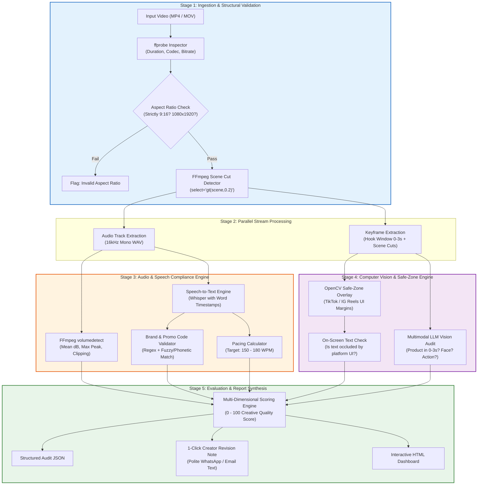

# Video QA & Creative Compliance Pipeline Specification 📐

Comprehensive engineering specification for the autonomous **Video Quality Assurance & Creative Compliance Engine**.

---

## 1. System Overview & Commercial Mission

Modern direct-to-consumer (DTC) brands and influencer marketing agencies manage dozens of creator deliverables weekly. Each video submitted by a creator must be inspected for:
1. **Technical Specifications:** Correct 9:16 vertical aspect ratio, minimum 1080p resolution, no audio clipping.
2. **Platform Safe Zones:** Ensuring on-screen captions or key visual elements are not hidden behind TikTok or Instagram Reels UI elements (Like buttons, captions, audio track ticker).
3. **Brief Compliance:** Ensuring the physical product is visible within the **first 3 seconds (The Hook)**, the brand name is pronounced correctly, and the specific discount promo code is spoken out loud.

This pipeline automates 100% of this inspection in **under 30 seconds per video**, delivering an actionable **Audit Scorecard** and an automated **Creator Revision Message**.

---

## 2. End-to-End Pipeline Architecture



---

## 3. Subsystem Specifications

### Step 1: Structural & Container Probe (`analyzer/probe.py`)
*   **Tooling:** `ffprobe`, `ffmpeg`
*   **Inspections:**
    *   **Aspect Ratio Validation:**
        $$\text{Aspect Ratio} = \frac{\text{Width}}{\text{Height}} \approx \frac{9}{16} = 0.5625 \pm 0.02$$
        *If ratio is 16:9 or 1:1, immediately trigger a critical failure flag: "Horizontal/Square video submitted for vertical ad."*
    *   **Resolution:** Width $\ge 1080\text{px}$, Height $\ge 1920\text{px}$.
    *   **Framerate:** $\ge 23.976\text{ fps}$.
    *   **Duration:** Typically 15s to 60s for vertical ads.
*   **Scene Cut Detection Algorithm:**
    *   Uses FFmpeg's scene change score:
        ```bash
        ffmpeg -i input.mp4 -filter_complex "select='gt(scene,0.2)',metadata=print:file=-" -f null -
        ```
    *   Calculates average shot duration and rhythm (ideal UGC has a cut every 2.0 to 3.5 seconds to maintain high viewer retention).

---

### Step 2: Audio & Speech Compliance (`analyzer/audio_auditor.py`)
*   **Tooling:** `ffmpeg` (`volumedetect`), `Whisper` (or audio speech transcription model)
*   **Inspections:**
    1. **Audio Dynamics & Clipping:**
       * `max_volume`: Must be $\le -0.5\text{ dB}$ (prevents digital clipping/distortion).
       * `mean_volume`: Must sit between $-16.0\text{ dB}$ and $-11.0\text{ dB}$ (ensures clear vocal projection).
    2. **Brand & Promo Code Verification:**
       * Speech-to-text generates timestamped word transcript.
       * Regex search verifies:
         * Brand name spoken: *Yes / No (with timestamp)*.
         * Promo code spoken (e.g., "SAVE20", "GLOW"): *Yes / No (with timestamp)*.
    3. **Narration Pacing (WPM):**
       $$\text{WPM} = \frac{\text{Total Spoken Words}}{\text{Audio Duration in Minutes}}$$
       * Optimal performance pace: **150 – 180 WPM**.
       * $< 130\text{ WPM}$: Flagged as *"Too sluggish / Low energy"*.
       * $> 205\text{ WPM}$: Flagged as *"Too fast / Unclear pronunciation"*.

---

### Step 3: Safe-Zone Masking & Hook Auditing (`analyzer/vision_auditor.py`)
*   **Tooling:** `OpenCV`, Multimodal Vision API (Gemini Flash / OpenAI compatible)
*   **Platform UI Safe-Zone Coordinates (Standard 1080x1920 Vertical Video):**
    *   **Top Danger Zone:** $Y \in [0, 180\text{px}]$ (Search icon, Live header, status bar).
    *   **Bottom Danger Zone:** $Y \in [1560, 1920\text{px}]$ (Account name, caption lines, sound track ticker).
    *   **Right Sidebar Danger Zone:** $X \in [880, 1080\text{px}]$ and $Y \in [600, 1600\text{px}]$ (Profile avatar, Like count, Comment bubble, Bookmark, Share icon).
    *   **Action:** If on-screen burned-in text falls inside these danger zones, trigger a warning: *"Text occluded by platform UI"*.

```
   0px ┌────────────────────────────────────────┐
       │        TOP DANGER ZONE (0 - 180px)      │
 180px ├────────────────────────────────┬───────┤
       │                                │ RIGHT │
       │                                │ SIDE  │
       │                                │ DANGER│
       │          SAFE ZONE             │ ZONE  │
       │   (Keep Text & Logo Here)      │ (880- │
       │                                │ 1080) │
1560px ├────────────────────────────────┴───────┤
       │       BOTTOM DANGER ZONE (1560 - 1920) │
1920px └────────────────────────────────────────┘
       0px                            880px   1080px
```

*   **The 3-Second Hook Window Audit:**
    *   Extract keyframes at $t = 0.5\text{s}, 1.0\text{s}, 1.8\text{s}, 2.5\text{s}$.
    *   Multimodal LLM verifies:
        1. **Product Visibility:** Is the physical product or packaging clearly visible in the first 3 seconds?
        2. **Human Subject:** Is there an authentic human face / creator on screen?
        3. **Visual Hook Classification:** Categorizes hook style (*e.g., Problem Demonstration, Shock/Reaction, Split-Screen Comparison, Text Teaser*).

---

### Step 4: Multi-Dimensional Scoring Engine (`analyzer/report_generator.py`)
The pipeline calculates a unified **Creative Quality Score (CQS)** from 0 to 100:

| Category | Weight | Evaluation Criteria |
| :--- | :--- | :--- |
| **Technical Compliance** | **25%** | Aspect ratio strictly 9:16, $\ge 1080\text{p}$, no audio clipping. |
| **Hook Effectiveness** | **30%** | Product visible $\le 3.0\text{s}$, engaging visual hook present. |
| **Speech & Messaging** | **25%** | Promo code spoken, brand name spoken, WPM pacing 150–180. |
| **Safe-Zone Hygiene** | **20%** | No key visual text hidden behind TikTok/Reels UI icons. |

*   **Scoring Thresholds:**
    *   $\ge 85$: **APPROVED (Ready to Launch)**
    *   $70 – 84$: **APPROVED WITH WARNINGS (Minor non-critical issues)**
    *   $< 70$: **REVISION REQUIRED (Creator must re-shoot or re-edit)**

---

### Step 5: The Automated Creator Revision Note
When a video fails one or more checks, the agent automatically drafts a polite, constructive message:

> **Example Generated Message:**
> *"Hey Alex! Great energy on this draft! The visual hook in the first 2 seconds looks fantastic.  
> We have 2 quick adjustments before we can approve the deliverable:  
> 1. **Promo Code Missing:** Please mention the discount code 'GLOW20' out loud in the final call-to-action (around 0:22).  
> 2. **Text Safe Zone:** The on-screen text '30-Day Guarantee' at 0:15 is positioned too far to the right and gets cut off by the TikTok Like icon. Please shift it slightly towards the center.  
> Once you make those quick tweaks, we're ready to approve and release payment! Thank you!"*

---

## 4. Input & Output Data Contracts

### Input Rules Schema (`rules.json`)
```json
{
  "campaign_name": "Summer Glow Serum Q3",
  "brand_name": "Lumina Skincare",
  "promo_code": "GLOW20",
  "required_keywords": ["hyaluronic", "dermatologist", "glow"],
  "min_resolution": "1080x1920",
  "aspect_ratio": "9:16",
  "require_product_in_hook": true,
  "max_hook_delay_sec": 3.0,
  "target_wpm_range": [140, 185],
  "check_safe_zones": true
}
```

### Output Audit Report Schema (`audit_report.json`)
```json
{
  "video_path": "submissions/creator_sarah_draft1.mp4",
  "cqs_score": 78,
  "status": "REVISION_REQUIRED",
  "technical_audit": {
    "resolution": "1080x1920",
    "aspect_ratio": "9:16",
    "duration_sec": 28.4,
    "mean_volume_db": -13.2,
    "max_volume_db": -0.8,
    "clipping_detected": false
  },
  "speech_audit": {
    "brand_spoken": true,
    "brand_timestamp_sec": 4.2,
    "promo_code_spoken": false,
    "pacing_wpm": 164,
    "transcript_summary": "I was skeptical about Lumina until I tried it..."
  },
  "visual_audit": {
    "product_in_hook": true,
    "first_product_appearance_sec": 1.2,
    "hook_classification": "Physical Demonstration",
    "safe_zone_violations": [
      {
        "timestamp_sec": 15.0,
        "region": "RIGHT_SIDEBAR",
        "detail": "Text '30-Day Guarantee' overlaps with Like/Share icon area"
      }
    ]
  },
  "revision_note": "Hey Sarah! Great energy on this draft..."
}
```

---

## 5. Performance Benchmarks

*   **Structural Probe & Cut Detection:** $< 1.5\text{ seconds}$ (Pure FFmpeg CPU).
*   **Audio Dynamics & Speech Extraction:** $< 4.0\text{ seconds}$.
*   **Safe-Zone & Hook Vision Audit:** $< 12.0\text{ seconds}$ (Parallel Multimodal Vision API calls).
*   **Total Turnaround Time:** **$< 20\text{ seconds}$ per 30-second vertical video** on an Intel Core i7 without requiring a dedicated GPU.
